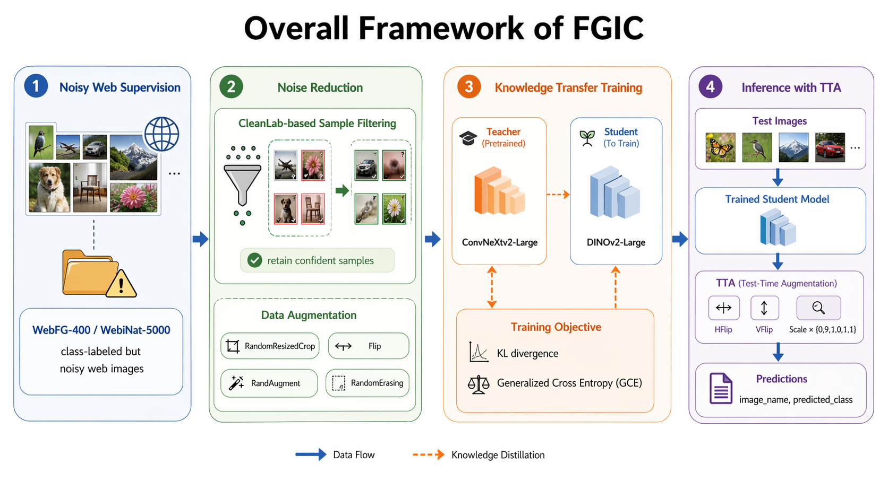

<div align="center">

# 🏆 FGIC Reproduction for AICOMP 2025 🏆

[](https://www.python.org/)
[](https://pytorch.org/)
[](https://developer.nvidia.com/cuda-toolkit)
[](https://www.docker.com/)
[](#)

This repository reproduces a **National First Prize** solution from the
**AICOMP 2025 Algorithm Challenge** (Network-Supervised Fine-Grained Image Classification).
Official challenge page: [click here](https://www.aicomp.cn/wp-content/uploads/2025/07/Competition-4-Weakly-Supervised-Fine-Grained-Image-Recognition.pdf)

</div>

## 📚 Framework


## ✨ Highlights

- 🧠 **Two-stage training pipeline**:
  - Teacher: `ConvNeXtv2-Large`
  - Student/Main: `DINOv2-Large` with knowledge distillation
- 🧹 **CleanLab-based data cleaning** via pre-generated index files
- ⚙️ **Multi-GPU distributed training** (DDP)
- 🔍 **Inference with TTA** (flip + multiply)
- 📦 **Fully Dockerized workflow** for reproducibility


## 🧭 Method Overview

The full pipeline is designed for two FGIC datasets:

- `WebFG-400`
- `WebiNat-5000`

For each dataset, training runs in the following order:

1. Train teacher model (`convnextv2_large`)
2. Train main model (`dinov2_large`) with teacher distillation
3. Run test inference and export CSV predictions

Distillation objective:

```text
loss = alpha * KL(student, teacher, T) * T^2 + (1 - alpha) * GCE(supervised)
```

## 📁 Project Structure

```text
FGIC/
├─ Dockerfile
├─ build_docker.sh
├─ run_docker.sh
├─ data.txt
├─ docs/
│  ├─ Problem.pdf
│  ├─ AICOMP.pdf
│  └─ AICOMP.pptx
├─ source/
│  ├─ entry.sh
│  ├─ main.py
│  ├─ requirements.txt
│  ├─ configs/
│  └─ src/
├─ train_output/
└─ test_output/
```

Container runtime paths:

- Workspace: `/workspace`
- Dataset root: `/data`

## 🛠️ Environment Requirements

- Linux + NVIDIA GPU(s)
- Docker + NVIDIA Container Toolkit
- Recommended memory: `>= 32 GB`
- Recommended GPU VRAM: `>= 32 GB per GPU`
- Multi-GPU is recommended for training

Core dependencies (`source/requirements.txt`):

## 🗂️ Dataset Preparation

You need both training and testing data for:

- WebFG-400
- WebiNat-5000

Expected mount targets in container:

- `/data/webfg400/train`
- `/data/webfg400/test`
- `/data/webinat5000/train`
- `/data/webinat5000/test`

Class-folder format requirements:

- WebFG-400: `000` to `399`
- WebiNat-5000: `0000` to `4999`

Reference download links are listed in `data.txt`.


## 🚀 Quick Start

### 1) Build Docker image

```bash
docker build -t FGIC:latest
or:
bash build_docker.sh
```

### 2) Run with mounted datasets

```bash
docker run --gpus all --shm-size=16g -it --rm \
  -u $(id -u):$(id -g) \
  -v /path/to/webfg400_train:/data/webfg400/train \
  -v /path/to/webfg400_test:/data/webfg400/test \
  -v /path/to/webinat5000_train:/data/webinat5000/train \
  -v /path/to/webinat5000_test:/data/webinat5000/test \
  -v $(pwd)/train_output:/workspace/train_output \
  -v $(pwd)/test_output:/workspace/test_output \
  FGIC:latest \
  /bin/bash entry.sh <mode>
```

Available `<mode>` values:

- `train400_teacher`
- `train400_main`
- `test400`
- `train5000_teacher`
- `train5000_main`
- `test5000`

## 📄 Outputs

### Training outputs

Generated under:

- `train_output/webfg400_teacher_convnextv2_large`
- `train_output/webfg400_main_dinov2_large`
- `train_output/webinat5000_teacher_convnextv2_large`
- `train_output/webinat5000_main_dinov2_large`

Typical files:

- `best_model.pt`
- `last_model.pt`
- `history.csv`
- `training_curves.png`

### Test outputs

Generated under:

- `test_output/webfg400_results/detection_results.csv`
- `test_output/webinat5000_results/detection_results.csv`

CSV format:

```text
image_name,predicted_class
```


## 🧩 Configuration Notes

Main config files are in `source/configs/`:

- `webfg400_teacher_train.yaml`
- `webfg400_model_train.yaml`
- `webfg400_test.yaml`
- `webinat5000_teacher_train.yaml`
- `webinat5000_model_train.yaml`
- `webinat5000_test.yaml`

Important fields you may tune:

- `batch_size`, `epoch`, `lr`
- `use_cleanlab`, `cleanlab`
- `distill_alpha`, `distill_temperature`

If GPU memory is insufficient, reduce `batch_size` first.

## 🌐 Pretrained Weights

Pretrained backbones are downloaded automatically and cached locally during execution.

- ConvNeXtv2-Large:
  `timm/convnextv2_large.fcmae_ft_in22k_in1k`
- DINOv2-Large:
  `facebook/dinov2-large-imagenet1k-1-layer`

The project sets `HF_ENDPOINT=https://hf-mirror.com` for faster download access.
